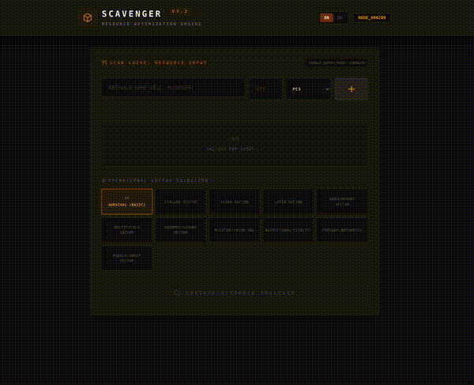

# 📦 SCAVENGER PROTOCOL: FIELD MANUAL
Your last resort to cook

```
Version: 0.9 (Beta)
Status: Online
Clearance: All Survivors
```

## 0. DEMO



### NOW IT IS AVAILABLE AT https://scavenger-your-last-resort-to-cook-230170771138.us-west1.run.app/
### TO VIEW VISITORS COUNT, CLICK HERE: https://api.counterapi.dev/v1/scavenger-ai-survival/global-nodes/

## 1. SYSTEM OVERVIEW
**Scavenger** is an AI-powered Resource Optimization Engine designed for low-supply environments. Unlike standard culinary databases, Scavenger does not require specific recipes to function. Instead, it **analyzes** your available inventory ("Supply Cache") and **hallucinates** viable sustenance protocols (recipes) to maximize caloric intake and morale. 

WARNING: The system assumes basic staples (Salt, Pepper, Oil, Water) are available in your sector.

## 2. SUPPLY CACHE LOGGING (INPUT)
To begin analysis, you must log every available edible resource into the system.

### Step-by-Step Logging: 
- **Resource Identification**: Enter the name of the item in the text field (e.g., Canned Beans, Unknown Meat, Rice).
- **Quantification**:
QTY: Enter the numeric amount.
UNIT: Select the measurement (PCS, G, KG, Cups, etc.) from the dropdown. 
- **Ingestion**: Click the + button (or press Enter) to lock the resource into the Supply Cache. 
- **Visual Indicators**:
Active Cache: Logged items appear as tags below the input line.
Removal: Click the X on a tag to purge a resource from the cache if it was logged in error or consumed.

## 3. PROTOCOL CONFIGURATION
Before initializing the AI core, configure your output parameters to suit your current situation.

**Target Protocol (Cuisine Bias)** \
Select a flavor profile to bias the generation engine

**General Survival:** \
Utilitarian, calorie-focused.
Comfort: High-morale dishes, usually richer. 

**Regional Sectors:** Italian, Asian, Latin (biases spices and cooking methods).

**Parameters Staples Check:** The system automatically flags "Staples Assumed" (Salt/Oil/H2O). You do not need to log these.


## 4. DATA INTERPRETATION (OUTPUT)
The system outputs data cards for each viable option. 
- **Status Stripes (Color Code)**
🟩 Green (Optimal): You have all necessary resources.
🟧 Amber (Sub-Optimal): You are missing non-critical ingredients, or substitutions are required. 
- **Card Data Points Protocol Name**: The survival-themed name of the dish.
Real World Match: The system identifies the closest pre-apocalypse dish (e.g., Survival Sludge -> Potato Soup). 
- **Visual Feed**: An AI-generated image of the dish. \
**Note**: If the image is loading, a "Rendering Visuals..." pulse will appear. \
**Critical Deficits**: A warning box listing missing ingredients and suggested scavenged substitutes.

## 5. EXTERNAL UPLINKS
To assist in preparation, the system provides two expansion modes:
"VIEW STEPS" / "ACCESS PREPARATION DATA":
Expands the card to show step-by-step cooking instructions.
"SCAN VISUALS" (Monitor Icon) 

- Function: This is a legacy internet uplink. 
- Action: Clicking this opens a YouTube search query for the "Real World Match" dish name. Use this to verify cooking techniques if the text instructions are unclear.

## 6. TROUBLESHOOTING
"Connection Interrupted": The AI uplink failed. Check your network connection and retry. \
"Visual Corrupted": The image generation model failed to render. The recipe is still valid; rely on text data. \
No Matches: Impossible. The AI is programmed to always invent a solution, even if it is just "Hot Water Soup."
End of Document. Stay safe out there.
